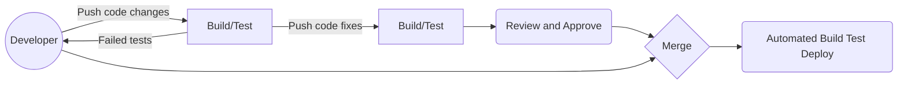
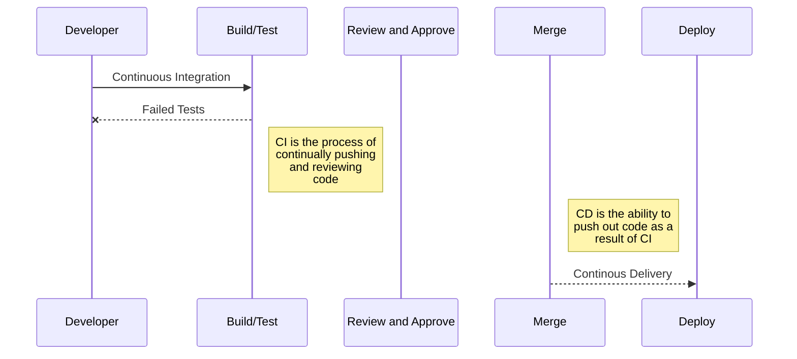

# AIAP Batch 5 Assignment 7

This project is done as part of AIAP assignment 7. This is a front-to-end
project, where the end goal is to serve a deep learning model on the web.
In this web app, a trained model is used to predict 12 different food classes,
namely chilli crab, curry_puff, dim sum, ice kacang, kaya toast, nasi ayam, 
popiah, roti prata, sambal stingray, satay, tau huay and wanton noodle. 

This app is deployed at this (link)[5].

## Architecture of Model

The base architecture is a ResNet50 model, followed by a Dense layer of 512 
neurons and a Dropout layer of 0.2. It is fine-tuned on the last 3 layers on
a training set of about 800 images. Optimizer used was Adam with a learning
rate of 0.001 and decay of 0.000001. The validation accuracy achieved was 70%.

Below table provides a summary of other specifications:

|Specification|Description
|---|---
|Framework|Tensorflow with Keras
|Base Model|ResNet50
|Weights|ImageNet
|Loss          |Cateogorical Cross Entropy
|Activation Function          |Softmax
|Optimizer|Adam
|Learning Rate (Decay)|1e-3 (1e-6)
|Batch Size|32
|Train-Test-Split %|80-10-10
|Image Dimensions|224 x 224 x 3

### Preprocessing and Training

1. **Dealing with images**

Images have to be resized because of our base architecture that we use which is
ResNet50. It is pre-trained on *ImageNet* on (224 x 224 x 3) images, hence it 
would be advisable to use images of those sizes. Therefore, we used the 
``ImageDataGenerator`` object together with the ``flow_from_directory`` object 
from Keras to augment and resize our image. Namely, these are the augmentations
that were performed:

```
self.shape = 224
self.batchsize = 32
train_datagen = ImageDataGenerator(
    rotation_range=15,
    width_shift_range=0.1,
    height_shift_range=0.1,
    horizontal_flip=True)
                
train_generator = train_datagen.flow_from_directory(
    self.directory + 'output/train/',
    target_size=(self.shape, self.shape),
    batch_size=self.batchsize,
    class_mode='categorical')
```
> **Note**: Augmentation is only done on the train set

2. **Building the model**

The model is built on top of ResNet50 and fine-tuned on the last 3 layers,
with an additional Dense layer at the end together with a Dropout layer.

```
model = ResNet50(input_shape=(self.shape, self.shape, 3), 
                 include_top=False, 
                 weights='imagenet')
                 
for layer in model.layers[:-3]:
	layer.trainable = False

x = model.layers[-1].output
x = Flatten()
x = Dense(512, activation='relu')(x)
x = Dropout(0.2)
x = Dense(12, activation='softmax')(x)
model = tf.keras.Model(inputs=model.inputs, outputs=x)
```

3. **Training the model**

We use the Adam optimizer together with a categorical cross-entropy loss
function when we compile our model. We then fit the model on our images over
20 epochs with an ``EarlyStopping`` callback on validation loss with patience
of 3.

### Dataset used for Training

The images used for training consists of 12 different classes, including:

Food|No. of Images
---|---
Tau Huay|52
Curry Puff|85
Chilli Crab|82
Dim Sum|137
Ice Kacang|73
Kaya Toast|81
Nasi Ayam|69
Popiah|81
Satay|82
Wanton Noodle|81
Sambal Stingray|83
Roti Prata|81

### Performance of Model

Our model had a validation accuracy of 70%.

## Getting Started

### Prerequisites

We will be using Flask as our web application framework because it is lightweight
and designed to make getting started quick and easy. It wraps around Werkzeug and 
Jinja2. We will also require Tensorflow and sci-kit learn for our machine learning 
frameworks. Finally, we will require Pillow to deal with images.

To install TensorFlow 2.0, please refer to [TensorFlow installation page][1]
regarding the specific install command for your platform.

To install [Flask][2], please follow their installation documentation.

To install [Pillow][3], please follow their installation documentation.

### Usage

These instructions will get you a copy of the project up and running on your 
local machine for development and testing purposes. See deployment for notes 
on how to deploy the project on a live system.

#### To get inference on an image from Terminal:

```
git clone
python -m src.inference your_image.jpg
```

#### To get inference on Web App:

Run ``app.py`` locally by typing the commands in the Terminal:

```
python -m src.app
```

This will run the app on your local machine's port 8000. Copy the link into
the browser or type localhost:8000 in the url. S

Simply upload an image and select the ``Classify`` button to get a prediction!


## Running unit tests

We will be using pytest to run unit tests for our project. To install, please
follow this [link][4] to their installation documentation.

Unit tests are used to test the validity of our code. From the main project 
directory, run:

```
pytest
```

to execute the unit tests. Pytest will automatically scan the tests folder
and execute the functions in test_inference.py.

### Breaking down each unit test

Testing image shape: Our model runs on 224x224x3 images and by default, we have
functions to handle images that are not in these format. The following tests
whether or not the images have been successfully handled to fit that format.

```
SHAPE = 224
assert inf._resize_image(Image.open(TEST_IMG)).shape == (SHAPE, SHAPE, 3)
```

## Deployment

Our model is deployed on a Docker container and hosted on AISG's cluster. 

The web application is created using Flask, together with Pure-CSS as the
CSS template and Vue.js as the Javascript framework.

The folder structure is as such:

    src									# Main project folder
    ├── app.py							# Main file containing Flask
    ├── inference.py                    # Python file containing our Model
    │   ├── static						# Folder to contain static assets
	|	|	├── css
	|	|	|	├── main.css			# Main css file
	|	├── templates					# HTML templates folder
	|	|	├── index.html				# Contains bulk of our HTML body
	|	|	├── base.html				# Contains base HTML structure with links/scripts


Before using this code for deployment, please ensure that this runs on your
local machine first. You should attempt to build a Docker Image and run that
image locally before deploying it.

## What is CI/CD

``CI/CD`` stands for continuous integration and continuous development. In short, it allows DevOps teams to increase the speed of software development in a quicker and more consistent manner.

**TLDR:**
Continuous integration comes about when we integrate code in a shared repository, which will be validated when developers perform a **Merge** request
> Validation is done through a pipeline trigger, which will build, test and validate the quality of the developer's code. Upon validation, changes will then be made to the repository.

Continuous delivery is a result of having *continuous integration*
> Note that continuous delivery does not equate to automatic deployment. It simply means having the ability or option to deploy as a result of CI-validated code.

### CICD Workflow





## Authors

David Chong

[1]: https://www.tensorflow.org/install/pip#tensorflow-2.0-rc-is-available
[2]: https://pypi.org/project/Flask/
[3]: https://pillow.readthedocs.io/en/stable/installation.html
[4]: https://docs.pytest.org/en/latest/getting-started.html
[5]: https://aiap-food-classifier.herokuapp.com/